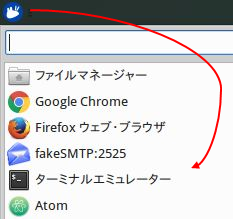

# Lab 1 - IBM API Connect 入門 
このラボでは、IBM API Connect (APIC) ソリューションのアーキテクチャー、機能および開発コンセプトについて概略的な理解を得ることを目的としています。このラボでは、APIC コマンドライン・インターフェースや、直感的な Web ベースのユーザー・インターフェースを使用し LoopBack アプリケーションを作成し、RESTful ベースのサービスの構成と操作に関するあらゆる面を探求する機会を全工程を通して設けています。

---
# Lab 1 - 学習目標 
このラボの学習目標は以下のとおりです。

+ 簡単な LoopBack アプリケーションの作成方法の習得
+ Representational State Transfer (REST) API 定義の作成方法の習得 
+ REST API をテストする方法の習得
+ 開発者ポータルに API を公開する方法の習得

---
# Lab 1 - このチュートリアルで利用するケース・スタディー
このチュートリアルでは、デフォルトの Hello World LoopBack アプリケーションを作成します。作成した成果物を確認し、内容の理解を深めます。hello-world アプリケーションは、「notes」をインメモリーに格納する簡単な RESTful サービスです。このラボでは、RESTful サービスと API の両方を新規に作成しますが、今後のラボでは、既存のサービスを使用して API を作成します。

---
# Lab 1	- 始める前に
このラボでは、API Connect Developer ツールキットが既にインストールされている Xubuntu 搭載の VMWare イメージを使用します。ラボを開始する前にイメージが稼働していることを確認してください。質問がある場合は、インストラクターに相談してください。

---
# Lab 1	- 手順

# 1.0 - ホスト・イメージのアップデート

1. Xubuntu ホスト・イメージのサポート・スクリプトを更新するために手早くパッチ適用を実行する必要がある場合があります。スクリプトを更新するためには、Terminal Emulator アプリケーションを起動します。
	
	

2. （この手順いらないでしょ？）ターミナルに以下を入力します:	```bash
	update_pot all
	```
	
3. この更新操作により、Git リポジトリーのクローンが作成され、サポート・ファイルが適切な場所へ移動されます。更新には数分かかります。完了するまでしばらくお待ちください。

# 1.1	- `hello-world` アプリケーションの作成

1.	API Connect Developer ツールキットのコマンドライン・インターフェースを使用して最初のアプリケーションを作成し、成果物を確認します。

2.	ターミナルのコマンドラインに以下を入力します:

	```bash
	apic loopback hello-world
	```
	
	このコマンドでアプリケーション開発ツール Yeoman が起動し、新規開発プロジェクトの作業をサポートしてくれます。表示される 3 つの質問に対しては、それぞれ Enter キーを押します。	
	```
	     _-----_
	    |       |    .--------------------------.
	    |--(o)--|    |  Let's create a LoopBack |
	   `---------´   |       application!       |
	    ( _´U`_ )    '--------------------------'
	    /___A___\
	     |  ~  |
	   __'.___.'__
	 ´   `  |° ´ Y `
	
	? What's the name of your application? hello-world
	? Enter name of the directory to contain the project: hello-world
	   create hello-world/
	     info change the working directory to hello-world
	
	? What kind of application do you have in mind? hello-world (A project containing a basic working e
	xample, including a memory database)
	```
	
	これで、「hello-world」というアプリケーションが、同じ名前のディレクトリーの下に作成されます。このアプリケーションは基本的な Hello World アプリケーションです。コマンドラインのウィンドウには多くのメッセージが表示されますが、リソースがいくつか作成され、さまざまなノード・モジュールがインストールされているためです。ノード・モジュールがロードされ次第、プロセスは Swagger 定義と製品定義を作成します。プロセスの最後には、次のタスクについてヒントが提示されます。次のタスクをせっかく提案してくれているので、1 つ目のタスクだけでも実行してみましょう。

3. プロジェクト・ディレクトリーに移動します:
	
	```bash
	cd hello-world
	```

4. ディレクトリーをリスト表示します:

	```bash
	$ ls
	client  common  deinitions  node_modules  package.json  server
	```
	
	LoopBack あるいは Node.js アプリケーションに関する知識がある人は、いくつかのディレクトリーに見覚えがあるでしょう。経験の浅い人たちのために、作成されるいくつかのディレクトリーの説明を一覧にしました。

|ディレクトリーまたはファイル|説明|
|-----------------|-----------|
|client|アプリケーションにフロントエンドがある場合、HTML、CSS、JavaScript などが格納されるディレクトリー。今回のサンプル・アプリケーションでは、スタブ・ファイルである README.md のみを格納|
|common|サーバーとクライアント・アプリケーションの両方に共通するファイル|
|common/models|すべてのモデル JSON ファイルおよびモデル JavaScript ファイルが格納されるサブディレクトリー。ここでいうモデルとはデータ・モデルを指す|
|common/models/note.js|note データ・モデルのカスタム・スクリプト。このファイルには、モデル定義ファイルで定義されているメソッドの実装が含まれる|
|common/models/note.json|note モデル定義ファイル。このファイルには、このモデルのプロパティーとメソッドの定義が含まれる|
|definitions|このアプリケーションに含まれる API および製品の定義が格納されるディレクトリー|
|definitions/hello-world-product.yaml|hello-world 製品の YAML ファイル。ローカル・テスト用のデフォルト・プランも格納|
|definitions/hello-world.yaml|hello-world API 用の Swagger 定義ファイル。REST パスと操作、データ・モデルのスキーマ、およびセキュリティー要件などに関する情報を格納|
|node_modules|デフォルト・アプリケーションに必要なすべてのノード・モジュールを格納したディレクトリー|
|package.json|Node.js パッケージの標準規格。最も重要な点として、アプリケーション・パッケージの依存関係の情報を含む|
|server|Node.js アプリケーションと構成ファイルを格納するディレクトリー。今回のチュートリアルではすべてを網羅できませんが、いくつかの例を以下に列挙|
|server/server.js|このアプリケーションのメイン・アプリケーション・スクリプト。**注:** 定義は package.json に記述|
|server/config.json|REST API ルート、ホスト名、ポートなどのグローバル・アプリケーション設定を記述したファイル|
|server/model-config.json|モデルをデータ・ソースに結合し、REST を介してモデルが公開されるかどうかを指定するファイル|
|server/datasources.json|データ・ソースの構成ファイル|

> ![][info]
>
> クライアント・ディレクトリーにあるような `*.md` ファイルは社内資料に使用されるマークダウン・ファイルです。

# 1.2	-  `hello-world` アプリケーションの起動

1. アプリケーション開発ツールによるアプリケーション作成を学んだところで、API Designer の説明にうつりましょう。コマンドラインから以下を実行します:

	```bash
	apic edit
	```
Bluemix へログインせずに起動する場合は以下を実行します:

	```bash
	SKIP_LOGIN=true apic edit
	```

	```text
	TODO: add instructions for signing in to bluemix
	```

2. `run` ボタンをクリックして、アプリケーション・ランチャーを開き、hello-world サービスをテストします。

	
	
3. 次に、`start` ボタンをクリックし、`hello-world` アプリケーションを起動します。
	
	
	
4. 起動が完了すると、以下のような画面が表示されます。
	
	
	
5. アプリケーションが稼働し始めると、画面の右側に Stop と Restart のボタンが表示されます。
	
	
	
	これでサービスを探索してテストする準備が整いました。

	> ![][info]
	> 
	> 今回は Web ベースのエディターからアプリケーションを起動しましたが、API Connect Developer ツールキットでは、ターミナルから次のコマンドを実行してアプリケーションを起動することもできます: `apic start`

# 1.3	- `hello-world` アプリケーションのテスト

1. `Explore` ボタンをクリックし、API Explorer ビューに切り替えます。

	
	
	公開されているすべてのサービス・パスが表示されます。
	
	

2. では、Explore 画面に表示されている GUI を使用して、サービスをテストします。左側にはいくつかの REST サービスが定義されています。今回は、`POST /notes` および `GET /notes` を取り上げます。

	GET と POSTは、いずれも HTTP メソッドです (verb と呼ばれることもあります)。POST メソッドは作成用にサービスを呼び出します。GET メソッドはサービスから情報を取得します。今回、いずれのメソッドも `/notes` パスに対して実行されています。つまり、POST は `note` を作成し、GET は作成されたすべての `notes` を取得します。
	
3. まずはいくつか note を作成してみましょう。画面左の欄にある `POST /notes` リンクをクリックします。`POST /notes` サービスに関連した情報とコントロールが表示されるように、他の欄の情報が展開されます。

4. 作成した note をテストするために、`Call operation` ボタンが見えるまで、右の欄をスクロールダウンします。`Call operation` ボタンの上にある `Generate` リンクを使ってサービスをテストする呼び出しに使うダミー・データを生成します。

5. `Generate` リンクをクリックし、サンプル・データを生成します。
	
	
	
	
	
	実際ご利用の端末で生成されるデータは異なりますが、これでテストを開始する準備が整いました。
	
6. `Call operation` ボタンをクリックして、`Response` セクションまでスクロールダウンし、結果を確認します。
	
	結果内容に、`Code: 200 OK` と表示されているはずです。これは、新しい `note` が生成されたことを意味します。同じ結果がでなかった場合、以下のトラブルシューティングの手順を参照してください。
	
	
	
	> ![][troubleshooting]
	>
	> CORS の問題を示すエラー・メッセージが表示される場合、お使いのブラウザーの証明書に問題があります。修復するために提示されたリンクをクリックして、証明書を受け入れ、開いているタブを閉じてから、`Call operation` 操作を再試行してください。また、手順 5 は省略しないようにご注意ください。ペイロードを生成せずに `POST` 操作を実行するとエラーが発生します。
	
	
	
	> ![][troubleshooting]
  >
  > 以下のようなコード 500 のエラーが発生した場合、`Generate` ボタンをクリックしてから、`Call operation` 操作を再試行してください。この手順を踏まないと note が重複して作成されてしまいます。
	
	

7. note が 1 つ作成できたところで、他にもいくつか note を作成してみましょう。

	> ![][info]
	> 
	> `Generate` リンクの使用は必須ではなく、`Parameters` に直接データを入力する方法もあります。`Generate` 操作でテンプレートを作成して、それを使用して生成されたパラメーターを変更することもできます。ただし、すべてのパラメーターが必ず生成されるわけではありません。というのも、必須のパラメーターは `title` のみであるためです。`Generate` 操作を数回繰り返し、操作の感触をつかみましょう。
	
8. 最後に `GET /notes` サービスをテストしましょう。ここまでに複数の note を作成してあるはずです。左の欄の `GET /notes` リンクをクリックします。

	

9. `Call operation` ボタンまでスクロールダウンしてクリックし、結果までスクロールダウンします。
	
	
		
	結果セットに作成したすべての note が表示されているはずです。
		
	> ![][important]
	> 
	> 結果として空の配列 `[]` が返された場合、note が正しく作成されていないことを意味します。もしくは、アプリケーションを停止し、再起動した場合にも同じ結果が返されます。hello-world の例では、インメモリーのデータベースを利用しているため、ディスクにはいかなるデータも一切保存されません。つまり、サーバーを停止・再起動するとデータは失われます。アプリケーションを永続データ・ソースに接続する手順は、Lab 2 で説明します。

10. これで、アプリケーションのローカル・テストは終了です。`Run` ボタンをクリックし、アプリケーションのスタート画面に戻ります。

11. `Stop` ボタンをクリックして、アプリケーションを停止します。

	

# 1.4	-  API の開発者ポータルへの公開

1. `Publish` アイコンをクリックします。

	

2. メニューから `Add and Manage Targets` を選択します。

3. `Add a different target` を選択します。

	

4. IBM API Connect 管理サーバーへ接続するための接続情報を入力し、`Sign in` ボタンをクリックします。

	> API Connect host address: `mgr.think.ibm`
	
	> Username: `student@think.ibm`
	
	> Password: `Passw0rd!`  
	
	

5. "Select an organization and catalog" 画面で、`Sandbox` カタログを選択し、`Next` ボタンをクリックします。

	

6. "Select an App" 画面では、`None` アプリケーションを選択し、`Save` ボタンをクリックします。

	これで、オフラインのツールキット環境を中央管理サーバーと対話させるための設定が整いました。

7. `Publish` ボタンを再度クリックし、ターゲット (グレーの部分) を選択します。

	

8. ここで公開する API を指定することができます。例えばプロジェクトで複数の API 製品を扱っている場合などに、公開したい特定の API を選択することができます。
	
	また、API をステージングにとどめるオプションもあります。「ステージングのみ」のアクションでは、構成を管理サーバーにプッシュしますが、使用に向けて公開はしません。ステージングのみを実行する理由としては、ユーザー権限がステージングに限定されている、もしくは製品の公開は違うグループが担当しているなどが考えられます。
	
	`Publish` ボタンをクリックします。

	

9. `Publish` ボタンをクリックすると、開発者ポータルから API が使用できるようになります。

10. 製品の公開が完了するまでしばらくお待ちください。完了すると、公開に成功したことを示すメッセージが表示されます。

	

# 1.5	- 開発者ポータルで API を参照

1. Firefox Web ブラウザーの `+` ボタンをクリックし、新規タブを開きます。

	

2. `Portal` へのブックマークが保存されているので、このブックマークをクリックして、ポータルのホームページを開きます。 

	

3. `API Products` リンクをクリックし、ポータルに公開されている使用可能な製品を確認します。

	

4. 製品の一覧に、公開した `hello-world` API があるはずです。

  

	今回のラボでは、hello-world アプリケーションに関する基本的な操作しか紹介していません。カスタム・メソッドの実装に関しても掘り下げて、理解を深めることをお勧めします。今後のラボでは、開発者ポータルでの作業に重点を置いていきます。たとえば、ポータルのカスタム・テーマのインストール、アプリケーションの登録、API のサブスクライブ、個別のユーザー・アプリケーションを使ったテスト実施などに触れていきます。

5. `Firefox` Web ブラウザーを閉じます。複数のタブを閉じるときの警告が表示された場合、今後通知を受け取るオプションをオフにして、`Close Tabs` ボタンをクリックします。

	

6. ターミナルで `control+c` のショートカット・キーを使用して API Designer を終了します。

# Lab 1 - まとめ

**Lab 1 の学習過程は以上です。**初めての API を作成し、公開しました。

このラボで学習した内容:

+ 簡単な LoopBack アプリケーションの作成方法の習得
+ Representational State Transfer (REST) API 定義の作成方法の習得
+ REST API をテストする方法の習得
+ 開発者ポータルに API を公開する方法の習得

次は、[Lab 2 - LoopBack アプリケーションの作成](../Lab%202%20-%20Create%20a%20LoopBack%20Application)

[important]: https://github.com/ibm-apiconnect/pot-onprem-docs/raw/master/lab-guide/img/common/important.png "Important!"
[info]: https://github.com/ibm-apiconnect/pot-onprem-docs/raw/master/lab-guide/img/common/info.png "Information"
[troubleshooting]: https://github.com/ibm-apiconnect/pot-onprem-docs/raw/master/lab-guide/img/common/troubleshooting.png "Troubleshooting"
