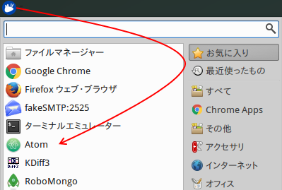
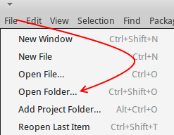
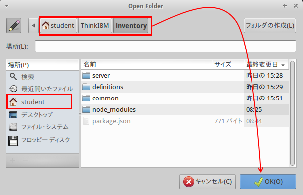
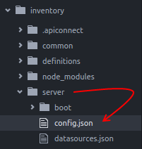
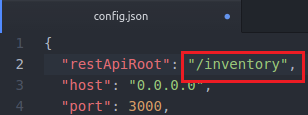
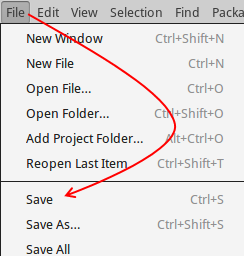

# Lab 3 - 在庫アプリケーションのカスタマイズとデプロイメント

このラボでは、Lab 2 で作成した LoopBack アプリケーションに関数を追加します。カスタム javascript コードを追加し、アプリケーションのデフォルト動作に変更を加えます。編集作業が終了したら、アプリケーションをパッケージ化し、WebSphere Liberty ランタイム集合に公開します。ここで、API Connect ソリューションがアプリケーションを管理、適用します。

---
# Lab 3 - 学習目標

このラボの学習目標は以下のとおりです。

+ LoopBack リモート・フックの学習
+ リモート・フックの作成方法の習得
+ Liberty ランタイム集合に LoopBack アプリケーションを公開する方法の習得

---
# Lab 3 - このラボで利用するケース・スタディー

これまでに、基本的なアプリケーション・テンプレートの作成、MySQL データ・ソースに接続する `item` データ・モデルの追加、MongoDB データ・ソースに接続する `review` データ・モデルの追加、`item` モデルおよび `review` モデル間の関係の構築を学習しました。

このラボでは、リモート・フックを追加し、`inventory` アプリケーションを拡張します。リモート・フックにより、API 呼び出しのプリプロセスとポストプロセスを実行できます。たとえば、リモート・サービスへのヘッダー情報の追加や、今回のラボで学習する値の計算などの処理があります。

その後、LoopBack 在庫アプリケーションを Liberty 集合に公開し、一般ユーザーが使用できるようにします。

 [Liberty 集合] (https://www.ibm.com/support/knowledgecenter/SSD28V_8.5.5/com.ibm.websphere.wlp.nd.doc/ae/cwlp_collective_arch.html) に関する詳しい情報はこちらをクリックしてください:

<https://www.ibm.com/support/knowledgecenter/SSD28V_8.5.5/com.ibm.websphere.wlp.nd.doc/ae/cwlp_collective_arch.html>

---
# Lab 3 - 手順

## Lab 3.1 - アプリケーション構成の編集

アプリケーションの API を公開する前に、生成された構成ファイルを編集する必要があります。生成されたアプリケーションの基本パスにはデフォルトで `/api` が使用されます。続く手順では、基本パスを `/inventory` に構成できるよう編集します。

1. アプリケーションのお気に入りメニューをクリックし、`Atom` テキスト・エディターを開きます。

	

2. `Atom` メニューの `File > Open Folder` をクリックします。

	

3. 「場所」メニューの `student` をクリックし、`ThinkIBM > inventory` フォルダーにナビゲートし、`OK` ボタンをクリックします。

	

	> ![][info]
	> 
	> LoopBack アプリケーションは構成ファイル一式を使用し、アプリケーション・ランタイムを実行します。これらのファイルに関する詳細情報は、Lab 1 の表を参照してください。

4. フォルダー・ツリーのメニューにある `server` フォルダーを展開し、`config.json` ファイルをクリックして、ソースを確認します。

	

5. `config.json` ファイルの 2 行目にある `/api` を `/inventory` に変更します。

	

6. `Atom` ファイル・メニューで変更を保存します。

	

## Lab 3.2 - リモート・フックの作成

リモート・フックは、LoopBack アプリケーションの操作を呼び出す前または呼び出した後に実行するカスタム javascript コードです。

リモート・フックに関する詳細情報は以下を参照してください。

<https://docs.strongloop.com/display/public/LB/Remote+hooks>

1. `Atom` エディターのディレクトリーを `common/models` まで展開し、`item.js` ファイルを選択します。

	

2. このファイルを更新して、品目に対し新規レビューが送信された*後に* 実行するリモート・フック関数を新たに含めます。この関数は、特定の品目に対するレビューの平均値を計算し、MySQL データ・ソースにある品目の評価を更新します。

3. 事前に用意されたサンプル・ファイルをコピーすることで、入力ミスを防ぐことができます。`Sublime Text` アプリケーションをお気に入りメニューから開きます。

	
	
4. `lab_files/lab3` フォルダーまでディレクトリーを展開し、サンプルの `item.js` ファイルを選択します。

	
	
5. メニューから `Selection > Select All` を選択し、テキストをすべてハイライトします。

6. メニューから `Edit > Copy` を選択し、ファイルのコンテンツをクリップボードへコピーします。

7. `Atom` アプリケーションへ戻り、`item.js`ファイルのコンテンツをすべて**消去**します。クリップボードのコンテンツを貼り付けて (`control+v` もしくは `Edit > Paste`)、ファイルを更新します。

	

	```javascript
	module.exports = function (Item) {
	  Item.afterRemote('prototype.__create__reviews', function (ctx, remoteMethodOutput, next) {
	    var itemId = remoteMethodOutput.itemId;
	    
	    console.log("calculating new rating for item: " + itemId);
	
	    var searchQuery = {include: {relation: 'reviews'}};
	
	    Item.findById(itemId, searchQuery, function findItemReviewRatings(err, findResult) {
	      var reviewArray = findResult.reviews();
	      var reviewCount = reviewArray.length;
	      var ratingSum = 0;
	
	      for (var i = 0; i < reviewCount; i++) {
	        ratingSum += reviewArray[i].rating;
	      }
	
	      var updatedRating = Math.round((ratingSum / reviewCount) * 100) / 100;
	
	      console.log("new calculated rating: " + updatedRating);
	
	      findResult.updateAttribute("rating", updatedRating, function (err) {
	        if (!err) {
	          console.log("item rating successfully updated");
	        } else {
	          console.log("error updating rating for item: " + err);
	        }
	      });
	      next();
	    });
	  });
	};
	```

	> ![][info]
	> 
	> `Atom` テキスト・エディターで右へスクロールすると、行の内容を説明するコードのコメントが表示されます。

8. `File > Save` メニューのオプションから変更を保存します。

## Lab 3.3 - Liberty 集合へのアプリケーションの公開

このセクションでは、`inventory` アプリケーションを一般ユーザーが使用できるように Liberty ランタイム集合へ公開します。

### 3.3.1 - API Connect および Liberty へのアプリケーションの登録

1. お気に入りメニューから `Firefox Web Browser` を起動します。

	  

2. `API Manager` ブックマークをクリックします。

	

3. 以下の資格情報を入力し、`Sign in` ボタンをクリックします:

	Username: `student@think.ibm`
	
	Password: `Passw0rd!`
	
	> ![][info]
	> 
	> ブラウザーにユーザー名およびパスワードが保存されている場合は、その資格情報をそのまま利用してサインインしてください。
	
	
	
4. API Manager ダッシュボードが開いたら、`+ Add` ボタンをクリックし、リストから `App` を選択します。

	

5. `Add App` フォームに以下の詳細を記入します:

	> Display Name: `Inventory`
	
	> Name: `inventory`
	
	> Collective: `AppSvr`
	
	

6. `Add` ボタンをクリックし、API Connect サーバーと Liberty 集合サーバーのアプリケーションを関連付けます。この操作により、公開後も API Connect からアプリケーションを管理できるようにアプリケーションを登録します。

### 3.3.2 - API Connect とやりとりするための Developer ツールキットの構成

1. `Inventory` アプリケーション・タイルにある `hyperlink` アイコンをクリックします。

	

2. ポップアップ・ウィンドウのコンテンツを、システムのクリップボードにコピーします。

	

3. ユーザー・プロファイルのアイコンをクリックし、`Log Out` を選択します。

	

4. タブまたはブラウザー・ウィンドウの `x` をクリックして Firefox ブラウザーを閉じます。

5. `Terminal Emulator` セッションに戻ります。閉じてしまった場合は、新規セッションを立ち上げてください。

6. 以下のコマンドを入力し、`~/ThinkIBM/inventory` プロジェクト・フォルダーに移動します:

	```bash
	cd ~/ThinkIBM/inventory
	```

7. ターミナルのメニュー・バーから `Edit > Paste` を選択し、クリップボードのコンテンツを貼り付けます。先ほどのステップでコマンドをコピーしなかった場合は、こちらに手入力できます:

	```bash
	apic config:set app=apic-app://mgr.think.ibm/orgs/sales/apps/inventory
	```

8. API Connect 管理サーバーにログインし、開発環境のセットアップを続けます。

	```bash
	apic login --type app
	```
	
9. プロンプトが出たら、以下の資格情報を入力します:

	> Server: `mgr.think.ibm`
	
	> Username: `student@think.ibm`
	
	> Password: `Passw0rd!`

### 3.3.3 - アプリケーションの公開

1. 以下を入力し、Liberty 集合サーバーが稼働していることを確認します:

	```bash
	wlpn-controller start
	```

2. 以下のコマンドを入力し、`inventory` アプリケーションをパッケージ化して、集合サーバーへ公開します:
	
	```bash
	apic apps:publish
	```
	
	> ![][info]
	> 
	> アプリケーションを公開するために、ここまでコマンドラインを使用してきましたが、API Designer の Web エクスペリエンスを使用してこのタスクを同様に実行することができます。

3. 公開が完了すると、ターミナルにプロンプトが出ます。

	

4. ここで返される `host` ヘッダーは、次のラボで必要になります。

	`host header:` 値を**ハイライト**して、**マウスの右クリック**で開くメニューから `Copy` を選択します。

	
	
5. タスクバーにあるメモ帳のアイコンをクリックし、`Notes` アプリケーションを開きます。

	
	
6. 「host」ヘッダーを `Notes` ウィンドウに貼り付けて (`control+v` のショートカットキーを使用) 、内容がわかるような名前をつけます。

	

# Lab 3 - 検証

CLI と API Designer の両方を使用し、多くのファイルを作成および更新しました。次のラボへ進む前に、ソース・ファイルと完成したラボとを照らし合わせて検証するための簡単なスクリプトを用意しました。この手順を踏むことで、後に入力ミスに起因した問題の発生を防止することができます。

1. `Terminal Emulator` で以下を入力します:

	```bash
	validate_lab 3
	```
	
2. このスクリプトはプロジェクト・フォルダー (`~/ThinkIBM/inventory`) にある特定のファイルに対し一連の `diff` コマンドを実行します。

3. `validate_lab` スクリプトの出力に不一致があった場合、以下を入力し、訂正した変更をソース・ファイルに統合します:

	```bash
	merge_lab 3
	```

# Lab 3 - まとめ

このラボで学習した内容:

+ リモート・フックの作成方法の習得
+ リモート・フックのテスト方法の習得
+ アプリケーションの Liberty 集合への公開方法の習得

次は、[Lab 4 - API の構成と保護](../Lab%204%20-%20Configure%20and%20Secure%20an%20API)

[important]: https://github.com/ibm-apiconnect/pot-onprem-docs/raw/master/lab-guide/img/common/important.png "Important!"
[info]: https://github.com/ibm-apiconnect/pot-onprem-docs/raw/master/lab-guide/img/common/info.png "Information"
[troubleshooting]: https://github.com/ibm-apiconnect/pot-onprem-docs/raw/master/lab-guide/img/common/troubleshooting.png "Troubleshooting"

